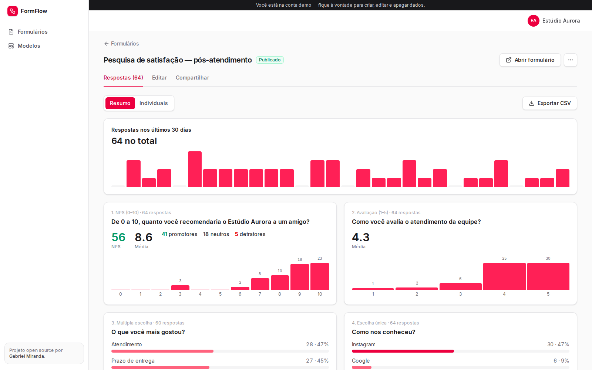
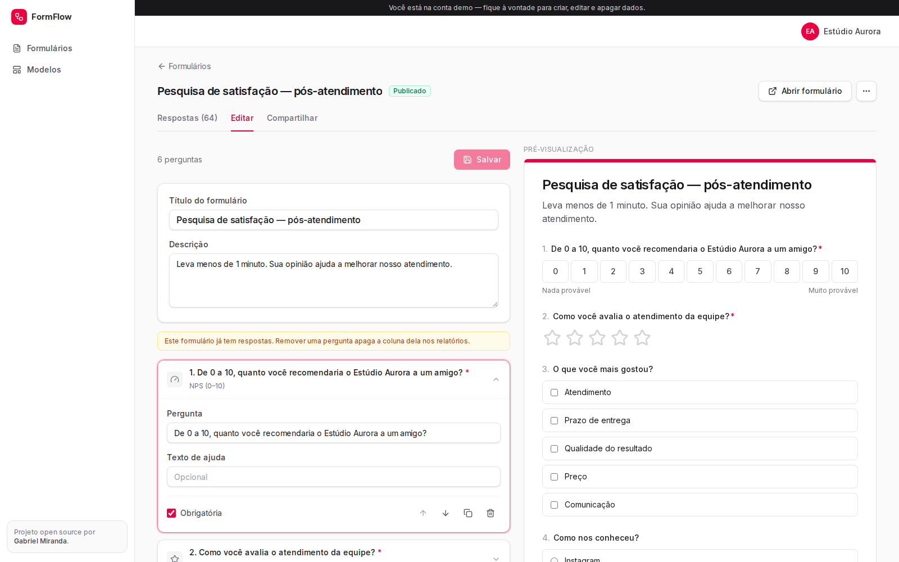

# FormFlow


**Form builder for surveys, project briefings and sign-ups.** Build a form with a live preview,
share a link or embed it on any website, and read the answers as a ready-made report — NPS,
charts per question, CSV export and a webhook on every response so the data flows into your CRM.



> **Try it:** open the app and click **"Explorar com a conta demo"** — three forms with ~110
> realistic responses are waiting. (`demo@formflow.dev` / `demo1234`)
> Public demo form: `/f/demo-briefing`

## Features

| | |
| --- | --- |
| **Builder with live preview** | 12 question types (text, e-mail, phone, number, date, single/multiple choice, dropdown, 1–5 rating, NPS 0–10, yes/no). Reorder, duplicate, mark as required. |
| **Automatic summary** | Per-question charts, rating averages, **NPS score** with promoters/passives/detractors, responses per day. |
| **Share anywhere** | Public link and `<iframe>` embed code (`?embed=1` renders a chrome-less version). |
| **Webhooks** | Every response triggers a JSON `POST` (Zapier, n8n, Make, your API). Test button and delivery log with status code and latency. |
| **CSV export** | Excel-friendly (UTF-8 BOM, `;`), protected against CSV formula injection. |
| **Lifecycle** | Draft → Published → Closed. Drafts return 404 publicly; closed forms show a friendly message. |



## Architecture

```
Respondent ─► /f/[slug] (public) ─► submitResponse (Server Action)
                                     ├─ Zod schema generated from the form's fields
                                     ├─ INSERT response (answers as JSONB)
                                     └─ after(): deliver webhook (5s timeout, SSRF guard, logged)

Owner ─► /app/** (protected by proxy.ts) ─► Server Components + Server Actions ─► Prisma ─► Postgres
```

- **Validation is derived from the form itself.** `buildAnswerSchema()` turns the field list into
  a Zod schema, so required fields, allowed options and score ranges are enforced on the server —
  the browser's validation is only a convenience.
- **Stable field IDs.** Answers are stored as `{ [fieldId]: value }`. Editing a question keeps its
  ID, so renaming or reordering never breaks existing responses.
- **Webhooks never slow down respondents.** Delivery happens in Next.js `after()`, with a 5-second
  timeout, no redirects, and DNS resolution checked against private/loopback ranges to prevent
  SSRF.
- **Spam**: invisible honeypot input; bots get a fake success and nothing is stored.
- **Embedding**: `/f/*` is served with `frame-ancestors *`; every other route keeps
  `X-Frame-Options: SAMEORIGIN`.

## Running locally

Requirements: Node.js 20+, Docker.

```bash
cp .env.example .env.local        # then set AUTH_SECRET (npx auth secret)
npm install
npm run setup                     # Postgres + migrations + demo seed
npm run dev                       # http://localhost:3102
```

To test webhooks against a local endpoint set `WEBHOOK_ALLOW_PRIVATE=true` (development only).

## Deploy

Vercel + any Postgres. Set `DATABASE_URL`, `AUTH_SECRET`, `NEXT_PUBLIC_APP_URL`, then run
`npm run db:deploy` and `npm run db:seed` once.

## Stack

Next.js 16 · React 19 · TypeScript · Prisma 7 · PostgreSQL (JSONB) · Auth.js v5 · Zod 4 ·
Tailwind CSS 4 · Radix UI

---

Built by [Gabriel Miranda](https://www.letinfo.dev) · MIT License
